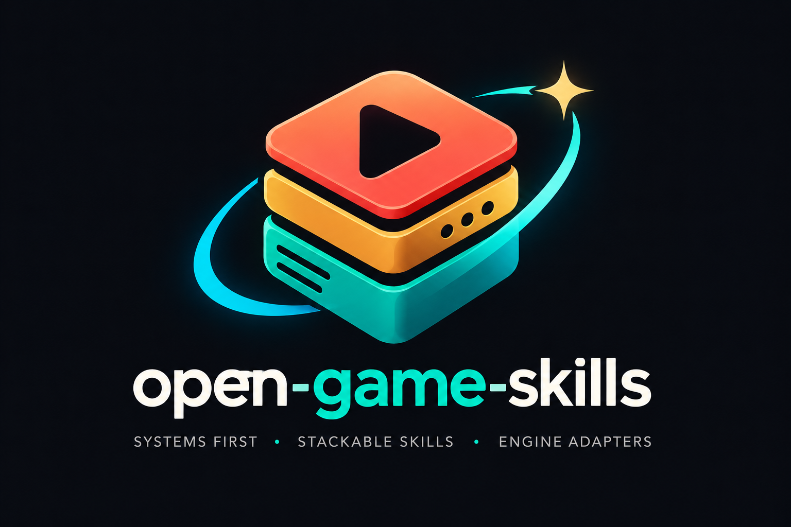

# open-game-skills

<p align="center">
  
</p>

<p align="center">
  <a href="README.md">English</a> · <a href="README.zh.md">简体中文</a> · <a href="README.zh-Hant.md">繁體中文</a> · <a href="README.ja.md">日本語</a> · <b>한국어</b>
</p>

<p align="center">
  <strong>게임 제작용 범용 Agent Skill.</strong><br/>
  평소처럼 말하면 dispatcher가 skill과 열을 고른다.
</p>

기본 문서는 [English README](README.md).

## 먼저 말하기

[`skills/SKILL.md`](skills/SKILL.md) → [`dispatcher`](skills/dispatcher/SKILL.md). 출력은 `USE / ENGINE / ASK / DEFER`. 단계마다 최대 3개 전문 skill과 필요한 engine 1개를 사용합니다. 나머지는 다음 단계에서 처리합니다.

| 말 | 불러야 할 것 |
|---|---|
| 스트리트 파이터식 3D | `fighting-design` / grounded-footsies · `action-feel` / short-special |
| 퀘스트 화살표 없는 오픈월드 | `world-map` · `camera-anti-clip` |
| 점프가 떠다 | `platform-jump` · `jump-leniency` |
| 초심자가 깨는가 | `gameplay-validation` / real-input |
| 히트스턴이 너무 길다 | `hitstun-recover` · `enemy-kit-balance` |
| 컷씬 뒤에 조이스틱을 돌려줄 것 | `cutscene-handoff` |

## 철칙

1. 히트스톱 ≠ 히트스턴. 유리 프레임 = 상대의 첫 행동 가능 tick − 자신의 첫 행동 가능 tick.
2. 플레이어 i-frame이나 스턴을 후려 적을 밸런스하지 말 것.
3. 텔레포트/잠금 해제/디버그는 자연 클리어가 아니다.
4. 결제와 외형은 캔슬 창이나 허트박스를 바꾸지 않는다.
5. 완성 스테이지나 프레임 테이블을 규칙에 넣지 말 것.

목록은 [English README](README.md).

```bash
git clone https://github.com/jammyfu/open-game-skills.git
cd open-game-skills
python3 tools/install.py --target "$HOME/.openclaw/workspace/skills"
```

실제 Agent skills 디렉터리를 지정하세요. 기존 파일이나 다른 링크를 덮어쓰지 않습니다. `--dry-run`으로 확인하고, 필요하면 `--copy`를 사용하세요. 복사본 업데이트는 수동입니다. Python 3.10+가 필요합니다. Windows에서는 `python`과 명시적인 경로를 사용하세요. 각 Agent의 자동 검색은 별도 검증이 필요합니다.

MIT. by jammyfu / PaintingCoder
