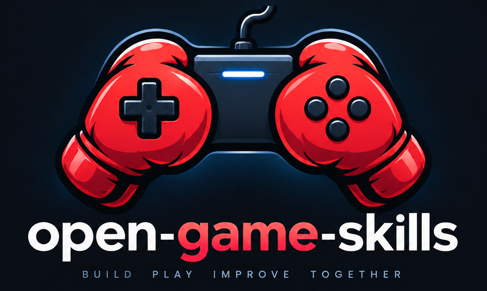

# open-game-skills

<p align="center">
  
</p>

<p align="center">
  <a href="README.md">English</a> · <a href="README.zh.md">简体中文</a> · <b>繁體中文</b> · <a href="README.ja.md">日本語</a> · <a href="README.ko.md">한국어</a>
</p>

<p align="center">
  <strong>做遊戲用的通用 Agent Skill。</strong><br/>
  直接說話。dispatcher 選 skill、選列。<br/>
  工作室與引擎是可疊的列，不是拿來抄的成品。
</p>

預設文件是 [English README](README.md)。

## 先說話

裝包後讀 [`skills/SKILL.md`](skills/SKILL.md) → [`dispatcher`](skills/dispatcher/SKILL.md)：

```
USE:
- <skill> / <列>
ENGINE: none | unknown | custom | threejs | pixijs | phaser | cocos | godot | unity | unreal
ASK: <最多一句>
DEFER: <後續階段或留空>
```

每階段最多 3 個專項技能（含資產/2D）+ 1 個必要引擎，其餘工作分階段繼續。`none` 表示純策劃無需引擎，`unknown` 表示尚未確定，`custom` 表示真正的自訂執行環境，不能用來代替猜測。

先讀[共用執行約定](skills/CONTRACT.md)，了解職責與證據界線。[自動產生的完整目錄](skills/catalog.json)包含全部技能；範例表格僅列出常用項目。

| 你說 | 應該裝 |
|---|---|
| 卡普空街霸式 3D | `fighting-design` / grounded-footsies · `action-feel` / short-special |
| 開放世界別畫任務箭 | `world-map` · `camera-anti-clip` |
| 跳得飄 | `platform-jump` · `jump-leniency` |
| 陌生人能不能通 | `gameplay-validation` / real-input |
| 硬直太長 / 精英沒反擊 | `hitstun-recover` · `enemy-kit-balance` |
| 過場把搖桿還回來 | `cutscene-handoff` |
| 移動平台 + 岩漿 | `moving-platform` · `hazard-volume` |

## 引擎適配器

[custom](skills/engines/custom/SKILL.md) · [threejs](skills/engines/threejs/SKILL.md) · [pixijs](skills/engines/pixijs/SKILL.md) · [phaser](skills/engines/phaser/SKILL.md) · [cocos](skills/engines/cocos/SKILL.md) · [godot](skills/engines/godot/SKILL.md) · [unity](skills/engines/unity/SKILL.md) · [unreal](skills/engines/unreal/SKILL.md)

## 鐵律

1. **卡肉 ≠ 硬直。** 優勢幀 = 受擊方首次可行動 tick − 攻擊方首次可行動 tick。
2. **不要靠偷玩家無敵或拉長玩家硬直來平衡怪。** 先調起手、收招、冷卻，最後 HP。
3. **傳送 / 改解鎖 / 調試場 不是自然通關。**
4. **內購與外觀不改取消窗口、不改判定盒。**
5. **不抄成品關卡或幀表進鐵律。** 只選列。

分簇鏈結以 [英文 README](README.md) 為準。

## 安裝

```bash
git clone https://github.com/jammyfu/open-game-skills.git
cd open-game-skills
python3 tools/install.py --target "$HOME/.openclaw/workspace/skills"
python3 tools/install.py --target "$HOME/.claude/skills"
```

上述路徑僅為範例，目標應設為實際設定的 Agent skills 目錄。安裝器建立父目錄，不覆蓋既有檔案或其他連結。用 `--dry-run` 預覽，無符號連結權限時加 `--copy`，複製更新需手動處理。需要 Python 3.10+；Windows 使用 `python`。保留完整目錄，自動探索機制需另外驗證。

## 更新既有安裝

在儲存庫目錄內執行；先提交或另外儲存自己的未提交變更。分支有分歧時先處理分歧，不要強制重設。

```bash
git switch main
git pull --ff-only origin main
```

符號連結安裝會直接使用更新後的原始檔。使用 `--copy` 的安裝，需先明確備份或移走舊安裝目錄，再重新複製；安裝器不會覆蓋它。更新技能包不會自動升級遊戲，也不會重新設定 Agent。

## 開發檢查

使用 Python 3.10+，建議在虛擬環境中操作。以下指令在儲存庫根目錄執行；Windows 將範例中的 `python3` 換成 `python`。

```bash
python3 -m pip install -r requirements-dev.txt
python3 -m unittest discover -s tests -v
python3 tools/skill_quality.py --check-catalog
```

新增、刪除或重新命名 skill 後，重新產生目錄，再執行測試：

```bash
python3 tools/skill_quality.py --write-catalog --check-catalog
```

這些指令檢查中繼資料、本地引用、目錄一致性、安裝器行為與多語言 README 的共用事實，不代表 LLM 路由準確性、引擎相容性、真人可玩性或翻譯品質已獲驗證。詳細範圍見[貢獻說明](CONTRIBUTING.md)。其餘技能的深度審查仍不應視為完成。

## 工程能力技能

每項附設定範例，以及正常、邊界、反例三類評測情境。寫好情境不代表已經實測。

| Skill | 負責什麼 |
|---|---|
| [game-state-flow](skills/disciplines/game-state-flow/SKILL.md) | 整局狀態轉換、過期非同步任務與冪等結算。 |
| [asset-runtime](skills/disciplines/asset-runtime/SKILL.md) | 資源載入、共享引用、取消與釋放。 |
| [procedural-generation](skills/disciplines/procedural-generation/SKILL.md) | 版本化生成、流程可達性與有上限的修復。 |
| [terrain-surface](skills/disciplines/terrain-surface/SKILL.md) | 區塊接縫、坡面、岸線與碰撞一致性。 |
| [world-streaming](skills/disciplines/world-streaming/SKILL.md) | 區塊就緒、駐留、傳送與世界改動保存。 |
| [physics-interaction](skills/disciplines/physics-interaction/SKILL.md) | 推拉、搬運、投擲與物理控制權。 |

[組合工作流程](skills/references/engineering-workflow.md) · [專項登記表](skills/engineering-registry.json) · [評測紀錄說明](docs/EVALUATION.md)

```bash
python3 tools/engineering_quality.py
```

登記表僅涵蓋這六項工程約定。此指令檢查結構及匯入紀錄的一致性，不呼叫模型；未匯入真實結果時，18 個情境全部為 `not-run`。靜態通過不等於模型行為或引擎實作通過。

## License

MIT。by jammyfu / PaintingCoder

## 測試優先重用開放素材

使用 [open-asset-fixture](skills/assets/open-asset-fixture/SKILL.md) 尋找適合 2D、3D、動畫、音效、特效、PBR 與 HDRI 測試的現成素材。參閱[來源與授權](skills/assets/open-asset-fixture/reference/sources.md)和[使用及狀態說明](skills/assets/open-asset-fixture/reference/usage.md)。優先重用符合要求且通過雜湊檢查的本機素材，再匹配免費 CC0 候選；CC-BY 須明確接受署名要求。腳本不會自動下載、購買或呼叫生成模型。

```sh
python3 skills/assets/open-asset-fixture/scripts/prepare_assets.py --skill materials
python3 skills/assets/open-asset-fixture/scripts/prepare_assets.py --all-skills skills/catalog.json --output asset-plan.json
python3 skills/assets/open-asset-fixture/scripts/prepare_assets.py --skill juice-vfx --root /absolute/fixtures --locks /absolute/fixture.lock.json --pinned-only
```

未設定需求的技能保留為 `needs-requirements`。`--pinned-only` 用於離線 CI，缺少素材即阻擋測試，不暗中替換。`needs-acquisition` 只是候選計畫，`ready-for-import` 也不代表解碼或引擎測試通過。TheLegendOfTrump 仍僅提供另外授權的素材，其未完成的遊戲實作不作為正確性依據，也不被改標為 CC0。
