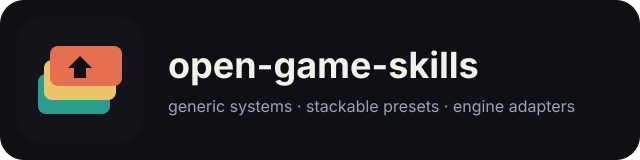

# open-game-skills

<p align="center">
  
</p>

<p align="center">
  <a href="README.md">English</a>
  · <a href="README.zh.md">简体中文</a>
  · <b>繁體中文</b>
  · <a href="README.ja.md">日本語</a>
  · <a href="README.ko.md">한국어</a>
</p>

<p align="center">
  <strong>做遊戲用的通用 Agent Skill。</strong><br/>
  系統優先。工作室和引擎是可疊加的列，不是拿來抄的模板。先問列，再寫程式。
</p>

給 OpenClaw、Claude Code、Codex、Cursor 用的開源 Skill 集群。
預設文件是 <a href="README.md">English README</a>。

## 這是什麼

- **學科** 決定資訊、難度、裝備、耐久、戰鬥、鏡頭、競速、Boss 怎麼跑
- **引擎 adapter** 只綁定六個原語
- **工作室 / 品類** 只負責選列，不再寫一套規則

這不是引擎 API 手冊。

## 動手前先問

| 系統 | 問什麼 |
|---|---|
| 地圖 | 資訊怎麼賺？誰能插銳？ |
| 難度 | 先改空間、資源，還是數值？ |
| 裝備 | 換件 / 升級樹 / 詞綴 / 融合 / 永久 — 按槽位？ |
| 耐久 | 碎了換 / 磨刀 / 回點修 / 不壞？ |
| 戰鬥 | 短緩衝 / 長取消 / 承諾白名單 / 土狼平台 |
| 競速 | drift-kart / boost-rail / grip-weight / combat-arena |
| 平台 | 手機 / 掌機座充 / 客廳 / 掌機 PC / 桌面 |

使用者說「通用」：不要世界跟角色等級踩，不要滿地圖任務箭，不要同一把劍又碎又能強化到終局，不要暗改極速。

## 安裝

```bash
git clone https://github.com/jammyfu/open-game-skills.git
ln -sfn "$(pwd)/skills" ~/.openclaw/workspace/skills/open-game-skills
```

對 agent 說：「world-map 區域揭霧 + 玩家插銳」「武器 A、防具 B、耐久碎換」「racing-feel 選 boost-rail，追趕 none」「platform-targets 手持與座充同一套模擬」。

## 許可

MIT。遊戲名歸原作者。Skill 寫公開設計原則和可選列，不是資產或私有源碼。

by jammyfu / PaintingCoder
